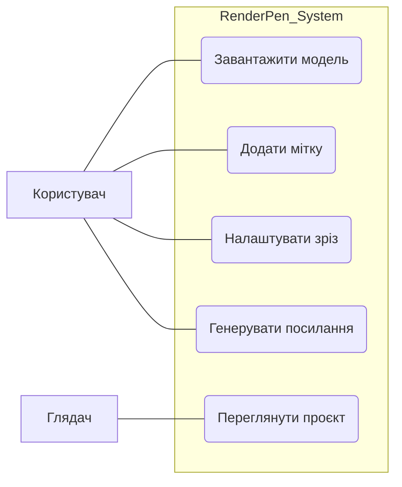
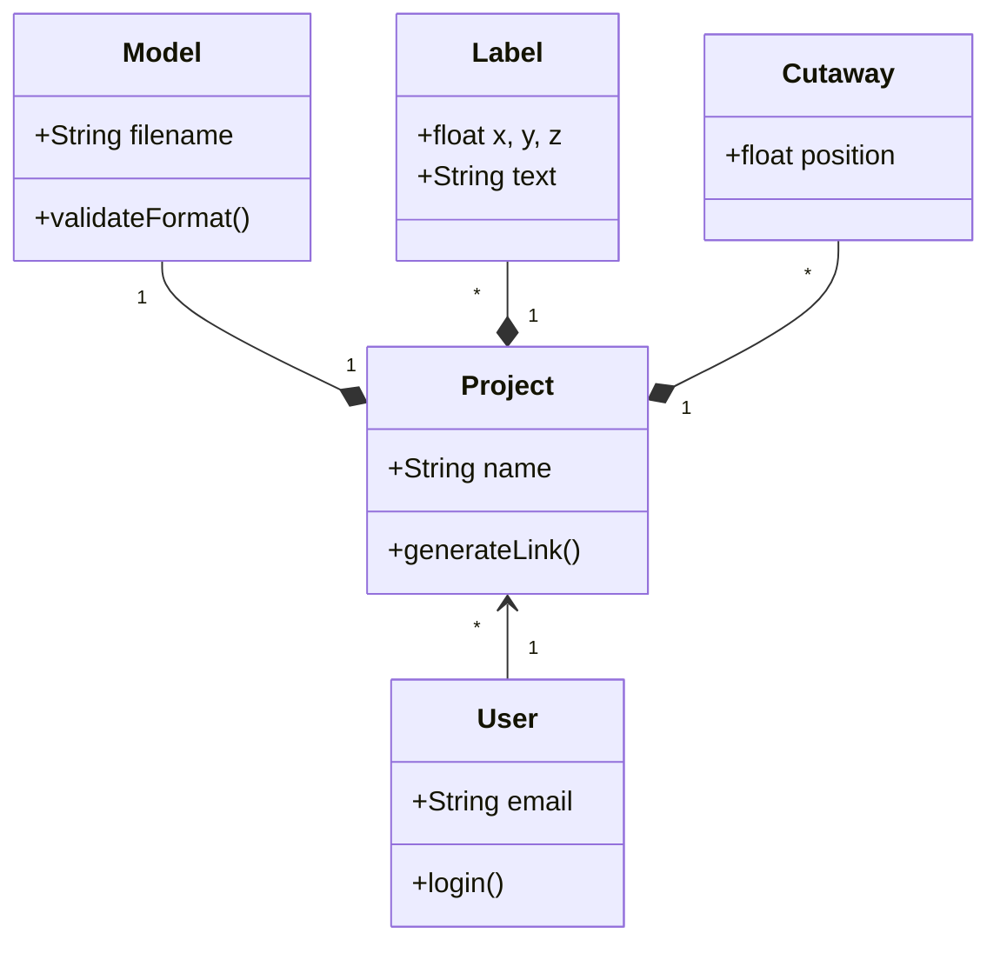
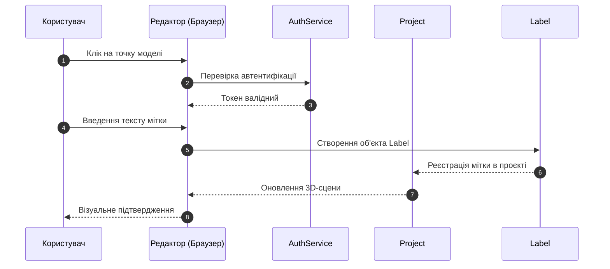

# Лабораторна робота №2: Моделювання програмної системи засобами UML

**Виконавець:** Тютюнник Віра Олексіївна
**Група:** ПЗПІз-25-1
**Проєкт:** RenderPen (renderpen.com)

## 1. Мета роботи
Набуття практичних навичок моделювання програмних систем із використанням уніфікованої мови моделювання UML (Unified Modeling Language). Оволодіння методами побудови діаграм прецедентів (Use Case Diagram), діаграм класів (Class Diagram) та діаграм послідовності (Sequence Diagram). Формування вміння забезпечувати трасовність (traceability) від функціональних вимог до моделей проєктування.

## 2. Функціональні вимоги (FR)
Для системи RenderPen визначено наступні функціональні вимоги:

| ID | Функціональна вимога | Пріоритет |
|:---|:---|:---|
| **FR-01** | Система має дозволяти користувачу завантажувати 3D-моделі у форматі .glb | Високий |
| **FR-02** | Система має дозволяти додавати текстові мітки (labels), прив'язані до координат моделі | Високий |
| **FR-03** | Система має забезпечувати функцію візуальних зрізів (cutaways) для показу внутрішніх частин | Середній |
| **FR-04** | Система має генерувати публічне вебпосилання для поширення готової інструкції | Високий |
| **FR-05** | Система має дозволяти глядачу обертати, масштабувати та переглядати кроки інструкції | Високий |
| **FR-06** | Система має забезпечувати автентифікацію для доступу до особистого кабінету автора | Високий |

## 3. Діаграма прецедентів (Use Case Diagram)
Діаграма відображає основні сценарії взаємодії Користувача (Автора) та Глядача з системою.

## 4. Діаграма класів (Class Diagram)
Діаграма описує статичну структуру системи, основні класи, їхні атрибути, методи та зв'язки між сутностями.

## 5. Діаграма послідовності (Sequence Diagram)
Демонструє динамічну взаємодію об'єктів у часі для сценарію "Додавання нової текстової мітки на 3D-модель".

  ## 6. Матриця трасовності
Таблиця демонструє відповідність між функціональними вимогами та створеними UML-артефактами.

| Вимога | Use Case | Класи | Sequence Diagram |
|:---:|:---:|:---|:---:|
| **FR-01** | UC1 | User, Model | — |
| **FR-02** | UC2 | Project, Label | SD-01 |
| **FR-03** | UC3 | Project, Cutaway | — |
| **FR-04** | UC4 | Project | — |
| **FR-05** | UC5 | Model, Project | — |
| **FR-06** | UC6 | User, AuthService | SD-01 (фрагмент) |